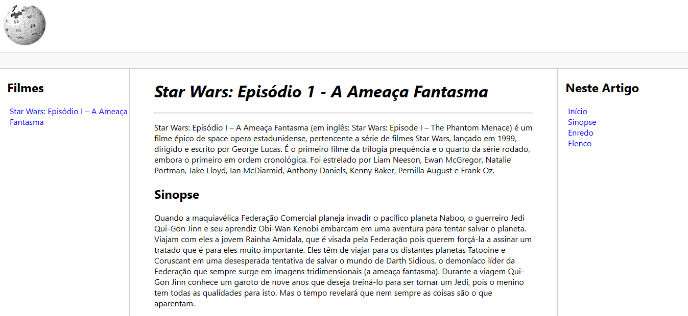

# Página Web - Wiki

 

Este desafio tem como objetivo, criar uma cópia do site Wikipédia, com tudo o que vimos no curso de HTML da DIO.

Assuntos abordados em aula:
- Estruturação e formatação de texto
- Mídias
- Links
- Semântica
- Acessibilidade

## Tecnológia
HTML e CSS

